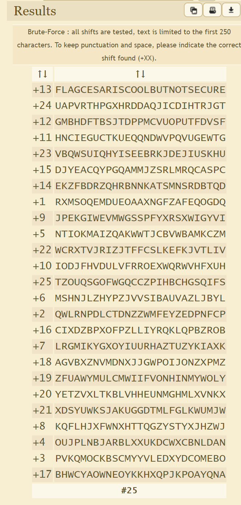

# Cryptography - Some martian message

## 1. Challenge
   
> SYNTPrfneVfPbbyOhgAbgFrpher

## 2. Solution

This is the simplest challenge in "Cryptography" class. 

If you have learned cryptography, you should known the earliest application of cryptography is ___Caeser Cipher___.

But we don't known the shift, which is the key of Caeser cipher. Here is a website that can help you brute force Caeser cipher: [https://www.dcode.fr/caesar-cipher](https://www.dcode.fr/caesar-cipher)

On this website, it will test all of the possible shifts and list result:

Find the most readable plaintext and submit it.